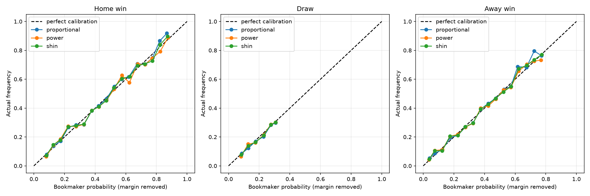
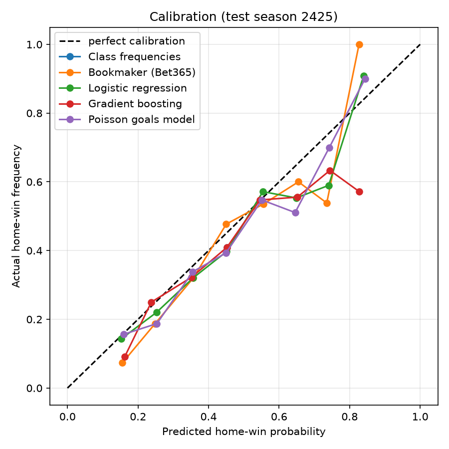

# Football Match Outcome Prediction


[](https://github.com/simassss/football-outcome-model/actions/workflows/tests.yml)


## Summary

**Question.** Can a model that uses recent team form and Elo ratings predict Premier League results (home win / draw / away win) better than bookmaker odds?

**Answer: no.** Models are trained on past matches only and tested walk-forward on 6 seasons (2019/20 - 2024/25, 2262 matches). Every model has a higher log loss than Bet365 (margin removed), the bookmaker is also ahead in the Ranked Probability Score, and the gap is statistically clear: in the pooled test over all 2262 matches every model is significantly worse than the bookmaker. Blending model and bookmaker probabilities does not beat the bookmaker alone (pooled log loss differences of the blends between 0.0000 and 0.0020, none significantly below 0), and form and Elo add no information beyond the odds (likelihood-ratio test p-values between 0.42 and 0.65). The value of the project is a leakage-free pipeline and an honest evaluation, not a betting edge: a simple value-bet backtest loses money.

| Approach | Mean log loss | Mean RPS | Log loss minus bookmaker (all 2262 test matches) | Diebold-Mariano p-value |
|---|---|---|---|---|
| Bookmaker (Bet365) | 0.9614 | 0.1973 | - | - |
| Class frequencies | 1.0690 | 0.2351 | 0.1076 | <0.000001 |
| Logistic regression | 0.9854 | 0.2046 | 0.0239 | <0.000001 |
| Gradient boosting | 0.9981 | 0.2071 | 0.0367 | <0.000001 |
| Poisson goals model | 0.9815 | 0.2040 | 0.0201 | <0.000001 |
| Dixon-Coles | 0.9831 | 0.2045 | 0.0217 | <0.000001 |

Lower is better for log loss and RPS. A positive difference means worse than the bookmaker. The mean is the average over the 6 test seasons.

## Key results

All numbers come from `results/*.csv` (written by `python main.py`).

### Log loss by test season

| Approach | 2019/20 | 2020/21 | 2021/22 | 2022/23 | 2023/24 | 2024/25 | Mean |
|---|---|---|---|---|---|---|---|
| Bookmaker (Bet365) | 0.9725 | 1.0101 | 0.9341 | 0.9649 | 0.9132 | 0.9738 | 0.9614 |
| Class frequencies | 1.0640 | 1.0929 | 1.0698 | 1.0498 | 1.0559 | 1.0816 | 1.0690 |
| Logistic regression | 0.9765 | 1.0528 | 0.9573 | 0.9955 | 0.9346 | 0.9954 | 0.9854 |
| Gradient boosting | 0.9932 | 1.0498 | 0.9624 | 1.0165 | 0.9495 | 1.0173 | 0.9981 |
| Poisson goals model | 0.9692 | 1.0448 | 0.9554 | 0.9951 | 0.9332 | 0.9915 | 0.9815 |
| Dixon-Coles | 0.9687 | 1.0203 | 0.9496 | 1.0052 | 0.9422 | 1.0125 | 0.9831 |

### Is any model better than the bookmaker?

For every model and season the log loss difference to the bookmaker is tested with a bootstrap interval (1000 resamples of the test matches) and a Diebold-Mariano test (`results/bootstrap.csv`, `results/dm.csv`, `results/dixon_coles_tests.csv`).

- Over 24 model-seasons (logistic regression, gradient boosting, Poisson and Dixon-Coles in 6 seasons), **18 are significantly worse than the bookmaker** (interval above 0), 6 cannot be told apart from it and **none is better**.
- Pooled over all 2262 test matches, the differences to the bookmaker are 0.0201 (Poisson), 0.0239 (logistic regression), 0.0217 (Dixon-Coles) and 0.0367 (gradient boosting) in log loss; all Diebold-Mariano p-values are <0.000001.
- Dixon-Coles versus the Poisson model: pooled difference 0.0016 (95% interval -0.0050 to 0.0076, p = 0.631), so the two cannot be told apart.
- **Blend with the bookmaker** (`weight x model + (1 - weight) x bookmaker`, weight from 0.0 to 1.0 chosen on the validation season only): the chosen model weights range from 0.0 to 0.6. The pooled log loss differences of the blends to the bookmaker are 0.0019 (logistic regression), 0.0006 (gradient boosting), 0.0020 (Poisson) and 0.0000 (Dixon-Coles), none significantly negative (p-values 0.0420, 0.2170, 0.0886 and 0.9967). 4 of the 24 blend-seasons are significantly worse than the bookmaker. One blend interval just excludes 0 in the model's favour (Blend: Poisson goals model, 2019/20: -0.0040, upper end -0.0001), but its Diebold-Mariano p-value is 0.0684, so it is not a reliable gain.

### Do form and Elo add information beyond the odds?

No. Model A uses only the bookmaker odds, model B adds the 7 form and Elo features (explained in [Methods](#likelihood-ratio-test-do-the-features-add-anything-to-the-odds)). `results/features_vs_odds.csv`:

| Test season | Training matches | LR statistic (df 14) | LR p-value | Log loss A | Log loss B | B minus A (95% CI) |
|---|---|---|---|---|---|---|
| 2019/20 | 3345 | 14.41 | 0.4199 | 0.9699 | 0.9740 | 0.0041 (-0.0023 to 0.0104) |
| 2020/21 | 3722 | 13.10 | 0.5186 | 1.0187 | 1.0232 | 0.0045 (-0.0030 to 0.0132) |
| 2021/22 | 4099 | 11.50 | 0.6465 | 0.9351 | 0.9372 | 0.0021 (-0.0038 to 0.0078) |
| 2022/23 | 4476 | 13.02 | 0.5249 | 0.9646 | 0.9658 | 0.0012 (-0.0054 to 0.0075) |
| 2023/24 | 4853 | 13.85 | 0.4609 | 0.9124 | 0.9140 | 0.0016 (-0.0040 to 0.0074) |
| 2024/25 | 5230 | 13.15 | 0.5147 | 0.9764 | 0.9778 | 0.0014 (-0.0034 to 0.0058) |
| All 2262 test matches | | | | 0.9629 | 0.9653 | 0.0025 (-0.0001 to 0.0051), p = 0.059 |

- The likelihood-ratio statistics (11.5 to 14.4) are about as large as the 14 that 14 useless extra coefficients give on average; all p-values are between 0.42 and 0.65.
- Out of sample, model B is **worse** than model A in all 6 seasons (by 0.0012 to 0.0045 in log loss).
- Model A is not better than using the bookmaker probabilities directly either (better in 3 seasons, worse in 3): the odds are already well calibrated.
- Of the 84 single feature coefficients (6 fits x 14), 3 have p < 0.05, about as many as chance gives (4.2 expected). All of them are the same coefficient (`home_ga`, `draw vs home win`) fitted on overlapping training data.

### Draws, 0-0 and 1-1

Average predicted probability against the real share, all 2262 test matches (`results/dixon_coles_draw_share.csv`; the bookmaker only gives a draw probability):

| | Draw | 0-0 | 1-1 |
|---|---|---|---|
| **Real share** | **0.2299** | **0.0539** | **0.1096** |
| Dixon-Coles | 0.2341 | 0.0661 | 0.1086 |
| Poisson goals model | 0.2269 | 0.0623 | 0.1077 |
| Bookmaker (Bet365) | 0.2367 | - | - |

Dixon-Coles does not predict draws or low scores better than the plain Poisson model: both predict too many 0-0 results, and the fitted correction parameter `rho` is small and unstable (between -0.0617 and 0.0279 depending on the season; `results/dixon_coles_parameters.csv`).

### Removing the bookmaker margin, and the favourite-longshot bias

Log loss and RPS of the bookmaker probabilities under three margin removal methods (mean of the 6 test seasons, `results/margin_methods.csv`):

| Method | Mean log loss | Mean RPS |
|---|---|---|
| Proportional | 0.9614 | 0.1973 |
| Power | 0.9617 | 0.1973 |
| Shin | 0.9616 | 0.1973 |

The method hardly matters. The favourite-longshot bias (longshots win less often than their probability says, favourites more often) was checked on all 5700 matches. Actual frequency minus predicted probability (standard error in brackets, `results/favourite_longshot.csv`):

| Group | Proportional | Power | Shin |
|---|---|---|---|
| longshots (probability below 0.20) | 0.0008 (0.0058) | 0.0080 (0.0057) | 0.0068 (0.0058) |
| middle (0.20 to 0.50) | -0.0045 (0.0045) | -0.0029 (0.0046) | -0.0038 (0.0045) |
| favourites (0.50 or more) | 0.0145 (0.0086) | 0.0000 (0.0084) | 0.0045 (0.0084) |

With the proportional method longshots win as often as priced and favourites win slightly more often than priced, which is within the noise (1.7 standard errors). `results/bookmaker_calibration.csv` and the plot below show the same for each outcome separately.



### Latest test season (2024/25) and a value-bet backtest

The backtest bets 1 unit on an outcome whenever `model probability x odds > 1.05`. The bookmaker places no bets because its own margin-free probability times its own odds is below 1.05.

| Approach | Log loss | Accuracy | Bets | Profit (units) | ROI % |
|---|---|---|---|---|---|
| Class frequencies | 1.0816 | 0.408 | 450 | -50.66 | -11.3 |
| Bookmaker (Bet365) | 0.9738 | 0.538 | 0 | 0.00 | 0.0 |
| Logistic regression | 0.9954 | 0.507 | 242 | -34.53 | -14.3 |
| Gradient boosting | 1.0173 | 0.515 | 351 | -74.91 | -21.3 |
| Poisson goals model | 0.9915 | 0.507 | 244 | -35.93 | -14.7 |

Every model that places bets loses money in this season. With a few hundred bets per season, profit and ROI are very noisy and are not evidence for or against a betting strategy.



## How it works

1. **Data.** Premier League results and Bet365 odds (`B365H`, `B365D`, `B365A`) from [football-data.co.uk](https://www.football-data.co.uk/englandm.php), 15 seasons (2010/11 - 2024/25, 5700 matches). All 15 files contain the odds without gaps. They are downloaded on the first run and cached in `data/`.
2. **Features.** For every match: the average points, goals scored and goals conceded of each team over its last 5 matches, and the difference of the two teams' Elo ratings (own Elo implementation; K factor and home advantage are tuned). A team needs 3 earlier matches before it gets features, so a few matches per season have none (377 test matches per season remain).
3. **No leakage.** The features of a match are computed only from matches played before it. Everything that is chosen (Elo K and home advantage, the Dixon-Coles time decay, blend weights) is chosen on the *validation season*, the season right before the test season. Unit tests check that changing a match's own result (or any later result) does not change its features or its prediction.
4. **Walk-forward evaluation.** For each test season (2019/20 - 2024/25) the models are trained on all earlier seasons and tested on that season. No shuffling.
5. **Approaches.** Class frequencies (always the training-set rates); the bookmaker probabilities (Bet365, margin removed); logistic regression and gradient boosting on the 7 features; a Poisson goals model; a Dixon-Coles goals model. (An optional comparison with ClubElo ratings, `--clubelo`, exists in the code but is untested, see Limitations.)
6. **Evaluation measures.**
   - *Log loss*: the average of `-ln(probability given to the real result)`. Lower is better and it punishes confident wrong forecasts.
   - *Ranked Probability Score (RPS)*: like log loss, but it uses the order home win < draw < away win, so predicting a draw when the home team wins is penalised less than predicting an away win.
   - *Bootstrap interval*: the test matches are resampled with replacement 1000 times; the 2.5% and 97.5% percentiles of the average log loss difference form a 95% interval.
   - *Diebold-Mariano test*: tests whether the average per-match loss difference between two forecasts is 0. It treats matches as uncorrelated and uses a normal approximation.
   - *Blend*: `weight x model + (1 - weight) x bookmaker`; if the model carried information the bookmaker lacks, the blend would beat the bookmaker alone.

## Methods explained

### Poisson goals model

Two Poisson regressions predict the expected number of goals of the home team and of the away team from the 7 features. Goals are assumed to be independent, so the probability of every scoreline from 0-0 to 10-10 is the product of the two Poisson probabilities; the scorelines are added up into home win, draw and away win.

### Dixon-Coles goals model

It learns each team's strength from the goals of all past matches instead of from the 7 features.

- **Attack and defence per team.** Every team has an *attack* value (higher = scores more) and a *defence* value (higher = concedes **more**, a weakness value), and there is one *home advantage* value. Expected goals: `home = exp(attack_home + defence_away + home_advantage)`, `away = exp(attack_away + defence_home)`. The attack values are centred (mean 0), otherwise adding a constant to all attack values and subtracting it from all defence values would give the same predictions.
- **Low-score correction `rho`.** Independent Poisson goals misjudge the scores 0-0, 1-0, 0-1 and 1-1. Their probabilities are multiplied by `1 - lambda*mu*rho`, `1 + mu*rho`, `1 + lambda*rho` and `1 - rho` (for 0-0, 1-0, 0-1, 1-1; `lambda` and `mu` are the expected goals of the home and away team). With a negative `rho`, 0-0 and 1-1 become more likely; with `rho = 0` the model is exactly the independent Poisson model. The factors must not become negative, so `rho` is bounded in the fit (-0.25 to 0.06, safe up to 4 expected goals per team) and moved into the allowed range for each match if needed (this never happened in the test seasons).
- **Time decay `xi`.** A training match played `days_ago` days before the day to predict gets the weight `exp(-xi * days_ago)`. `xi = 0` means all matches count the same; `xi = 0.001`, `0.002`, `0.005` mean a match counts half after 693, 347 and 139 days. `xi` is chosen from `0, 0.001, 0.002, 0.003, 0.005` on the validation season. The chosen values range from 0.001 to 0.005, and using no time decay was the worst choice on every validation season (`results/dixon_coles_parameters.csv`).
- **Fitting.** All parameters are found together by weighted maximum likelihood (`scipy.optimize.minimize`, L-BFGS-B, with the exact gradient; it suits a smooth function with about 80 parameters and allows the bound on `rho`). A small ridge penalty pulls attack and defence values gently towards the average, because a team with very few matches (for example 0 goals scored) would otherwise get an infinitely low attack value. This is a small departure from pure maximum likelihood.
- **No leakage.** The model is refitted once per block of 7 days, using only matches strictly before the first day of the block (the decay is measured from that day, at most 6 days before the match; for `xi = 0.005` this changes a weight by a factor of at most about 1.03). Every league is fitted separately. A team that is not in the training matches would get the average team (attack 0, average defence).

Worked example (fit on all matches before 2025-05-25 with `xi = 0.001`): home advantage 0.1627, `rho = -0.0081`. Arsenal at home has attack 0.4345 and defence -0.2245, Southampton away has attack -0.2460 and defence 0.4010. So `lambda = exp(0.4345 + 0.4010 + 0.1627) = 2.7136` expected home goals and `mu = exp(-0.2460 - 0.2245) = 0.6246` expected away goals. The model gives home win / draw / away win = 0.8116 / 0.1275 / 0.0609 and 0.0360 for 0-0. With `rho = 0` the same expected goals give 0.8121 / 0.1265 / 0.0614 and 0.0355 for 0-0: the correction is small because the fitted `rho` is small.

### Removing the bookmaker margin: proportional, power and Shin

The implied probabilities `1 / odds` of home win, draw and away win add up to more than 1; the excess is the bookmaker margin. It has to be removed to get three probabilities that add up to 1. Nobody knows where the bookmaker puts the margin, so every method is an assumption. Example match: odds 1.20 / 7.00 / 15.00, implied probabilities 0.8333 / 0.1429 / 0.0667, sum 1.0429.

- **Proportional.** Divide each implied probability by the sum, so every outcome keeps the same share (95.9% here): 0.7991 / 0.1370 / 0.0639.
- **Power method.** Raise every implied probability to the same power `k` and choose `k` so that the results add up to 1. Because the numbers are below 1, a power above 1 shrinks them, and small probabilities lose a larger share. Assumption: the bookmaker takes more of the margin from unlikely outcomes (longshots). Here `k = 1.0748` gives 0.8220 / 0.1235 / 0.0544: the favourite keeps 98.7% of its implied probability, the longshot 81.7%. The program finds `k` by narrowing an interval until the sum is 1 (`scipy.optimize.brentq`).
- **Shin's method.** Assume a small share `z` of the betting money comes from insiders who already know the result; the bookmaker cannot recognise them and protects himself with the margin. With `q_i = 1 / odds_i` and `B = q_home + q_draw + q_away`, the probabilities for a given `z` are `p_i = ( sqrt(z^2 + 4 (1 - z) q_i^2 / B) - z ) / ( 2 (1 - z) )`. With `z = 0` they add up to `sqrt(B)`, still above 1; a larger `z` makes them smaller, by a larger share for small `q_i`. The program searches for the `z` at which they add up to exactly 1. Here `z = 0.0224` (2.2% insiders) gives 0.8139 / 0.1305 / 0.0556: the favourite keeps 97.7%, the longshot 83.3%.

All comparisons with the bookmaker in this project use the proportional method. The three methods give almost the same log loss and RPS (see Key results).

### Likelihood-ratio test: do the features add anything to the odds?

Two multinomial logistic regressions (`statsmodels.MNLogit`, home win is the reference outcome, so there is one equation for draw and one for away win):

- **Model A (odds only):** the outcome depends on `ln(pDraw / pHome)` and `ln(pAway / pHome)` of the bookmaker's margin-free probabilities (proportional method). If the bookmaker were perfectly calibrated, the coefficients would be 1 on the own ratio, 0 on the other and 0 for the constant.
- **Model B (odds + features):** model A plus the 7 features (standardised with the training matches). That is 7 x 2 = 14 extra coefficients.

The *likelihood* says how probable the real results are under the fitted model. Model B has more freedom, so it always fits the training matches at least as well as model A. The question is whether it fits more than 14 meaningless extra numbers would by chance. The likelihood-ratio statistic is twice the gain in log-likelihood; if the features carry no information it follows a chi-square distribution with 14 degrees of freedom (average value 14). A p-value below 0.05 would say that the features help. The test is done on the training seasons; both models are then compared out of sample on the test season.

## Limitations

- **The models do not beat the bookmaker, and form and Elo add nothing to the odds.** Bookmaker odds contain information the models do not see (injuries, line-ups, news). The project does not show a betting edge; the value-bet backtest lost money.
- One league and 6 test seasons of 377 matches each, so small differences are within noise. Two of the test seasons are unusual: 2019/20 ended in July 2020 and was partly played without crowds, 2020/21 was played without crowds.
- The bootstrap and the Diebold-Mariano test treat matches as independent (the same teams play many matches), and none of the p-values or intervals is corrected for the many comparisons made, so a few single "significant" results are expected by chance. The conclusions rest on the consistent pattern and on the pooled tests, not on single results. The six likelihood-ratio tests share most of their training matches.
- The margin removal methods are assumptions that the data cannot tell apart. All model-versus-bookmaker tests use the proportional method.
- Dixon-Coles is refitted once per 7 days, not before every match. The time decay is chosen from a coarse grid on one validation season, and the chosen value changes from season to season; the blend weight is chosen on the same season and is therefore slightly optimistic and noisy. The ridge penalty is a small departure from pure maximum likelihood. The model uses only goals.
- Dixon-Coles gives an unseen (newly promoted) team the average strength. This is covered by a unit test only: in the real test matches it occurred 0 times, because the feature filter already drops the first matches of teams without 3 earlier matches. Fitting several leagues (each separately) is covered by a unit test on synthetic data; a run with five leagues completed without errors (about 6 minutes), but its results are not reported here.
- The likelihood-ratio test looks only for linear effects of 7 features, in one league; other information (xG, line-ups, injuries) or non-linear effects are not excluded.
- Elo tuning needs two earlier seasons, so the first test season can be 2012/13 at the earliest.
- The optional `--clubelo` comparison could not be verified: the ClubElo web service (`api.clubelo.com`) answered with an error (HTTP 502) when it was tried, so the program reported all teams as not found and skipped the comparison. It was also never tested with the full 2010 - 2025 history; team names from older seasons may have to be added to `CLUBELO_NAMES` in `main.py`. No ClubElo result is reported.

## How to run

```bash
pip install -r requirements.txt
python main.py                              # Premier League, test seasons 2019/20 - 2024/25
python -m pytest                            # unit tests (need no data and no internet)
```

Run both commands from the project folder (the one that contains `main.py`).

- **Data.** The first `python main.py` downloads the 15 Premier League files from football-data.co.uk (internet needed once) and caches them in `data/`; later runs use the cached files. The whole run takes about 1.5 minutes. The results are written to `results/`.
- **Options.** `python main.py --first-test-season 2021` (fewer test seasons, faster; allowed values are `1213` - `2425`), `python main.py --leagues E0 D1 SP1 I1 F1` (five big European leagues: E0 Premier League, D1 Bundesliga, SP1 La Liga, I1 Serie A, F1 Ligue 1; about 6 minutes in a test run, it downloads 75 files on the first run), `python main.py --clubelo` (experimental: tries to add a model with ClubElo ratings from clubelo.com; see Limitations).
- **Notebook.** `football_outcome_model.ipynb` runs the pipeline and shows the result tables and plots. Install Jupyter (`pip install jupyter`), start it from the project folder (`jupyter notebook football_outcome_model.ipynb`) and choose *Run All*. Without a browser: `python -m nbconvert --to notebook --execute --inplace football_outcome_model.ipynb`.
- **Tests.** `python -m pytest` uses only synthetic data. The same command runs on every push in GitHub Actions (`.github/workflows/tests.yml`, Python 3.10 and 3.12); `main.py` is not run there because it needs the data.

## Project structure

```
main.py                          data loading, features, models, evaluation (the whole pipeline)
football_outcome_model.ipynb     notebook that runs the pipeline and shows the results
tests/test_features.py           unit tests (including the no-leakage tests)
requirements.txt                 Python packages
README.md                        this file
LICENSE                          MIT license
.gitignore                       files that are not committed (data/, caches)
.github/workflows/tests.yml      runs the tests on every push
results/                         output of main.py:
  blend.csv                          model/bookmaker blend: chosen weights and log losses
  bookmaker_calibration.csv          bookmaker probabilities versus real frequencies, per outcome and bin
  bookmaker_calibration.png          calibration plot of the bookmaker probabilities
  bootstrap.csv                      bootstrap intervals of the log loss difference to the bookmaker
  calibration.png                    calibration plot of the latest test season
  dixon_coles.csv                    log loss and RPS of Dixon-Coles, Poisson, bookmaker, class frequencies
  dixon_coles_draw_share.csv         predicted versus real share of draws, 0-0 and 1-1
  dixon_coles_parameters.csv         chosen time decay, fitted `rho`, fit diagnostics
  dixon_coles_tests.csv              bootstrap and Diebold-Mariano tests of Dixon-Coles
  dm.csv                             Diebold-Mariano tests against the bookmaker
  favourite_longshot.csv             favourite-longshot check of the bookmaker probabilities
  features_vs_odds.csv               odds only (A) versus odds + features (B): likelihood-ratio test, log loss
  features_vs_odds_coefficients.csv  coefficients of model B
  margin_methods.csv                 bookmaker log loss and RPS with three margin removal methods
  metrics.csv                        latest test season: log loss, accuracy, value-bet backtest
  rps.csv                            Ranked Probability Score per approach and season
  walk_forward.csv                   log loss of every approach in every test season
data/                            cached match data (created on the first run, not committed)
```

## Stack

Python, pandas, numpy, scipy, scikit-learn, statsmodels, matplotlib, pytest; GitHub Actions for the tests.

## License

MIT License, see [LICENSE](LICENSE).
